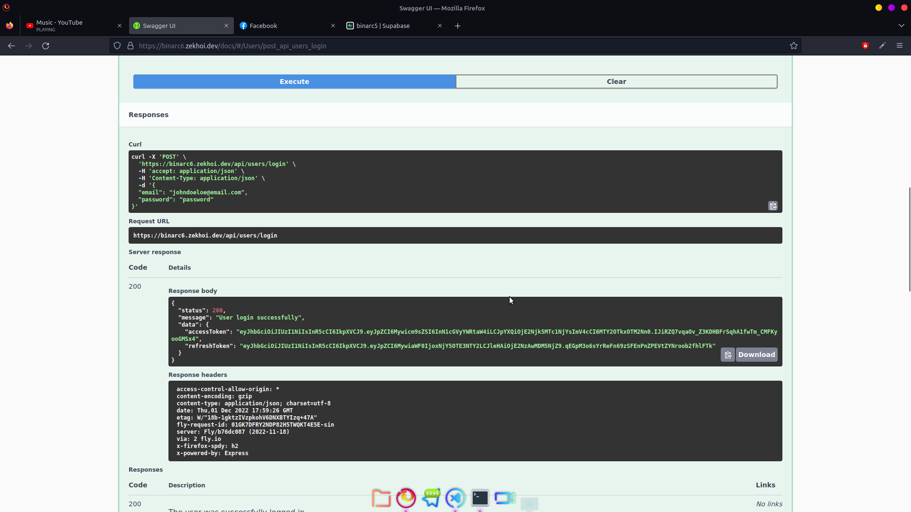
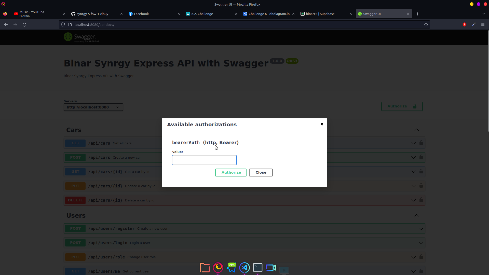

# Binar Challenge Chapter 6

Khoironi Kurnia Syah - Fullstack Web Development 1 (A) - Chapter 6

- Preview : [Open](https://binarc6.zekhoi.dev/api/cars/)

## Diagram

## API Docs

You can see the API documentation at

- Swagger UI : [https://binarc6.zekhoi.dev/docs](https://binarc6.zekhoi.dev/docs)

# Notes

Ada 4 hal tidak saya buat di submission ini, yaitu :

- migrations
- seeders
- deleted_by (soft delete)
- deleted_at (soft delete)

Saya mau membiasakan memakai typescript jadi mohon maaf jika ada yang kurang sesuai. Saya tidak membuat migrations dan seeders karena di typescript kurang banyak referensi dan banyak error untuk sequelize menggunakan sequelize-cli, jadi tidak saya buat. Tetapi sebenarnya saya sudah memahami fungsi dan manfaat kedua hal tersebut, mungkin akan saya buat di submission selanjutnya.

Ada beberapa kebingungan yang saya alami dalam hal createdBy, deletedBy, dan updatedBy pada model Car. Sebenarnya saya mau implementasi soft delete tapi sepertinya tidak memungkinkan karena saya agak sibuk.

## Users

| Email                | Password | Role       |
| -------------------- | -------- | ---------- |
| johndoe@email.com    | password | member     |
| johndoel@email.com   | password | admin      |
| johndoeloe@email.com | password | superadmin |

## Authentication

Try out login with example user (superadmin)

Masukan accessToken pada form Authorize

