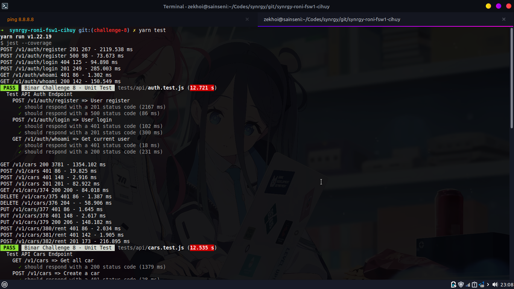
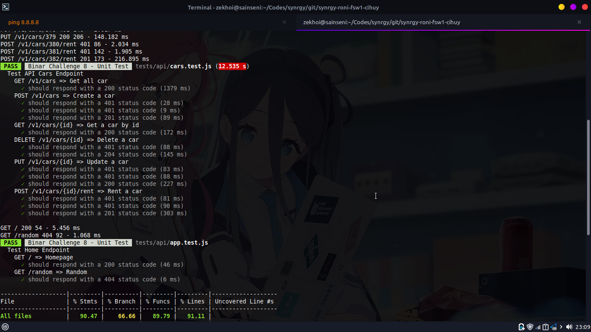
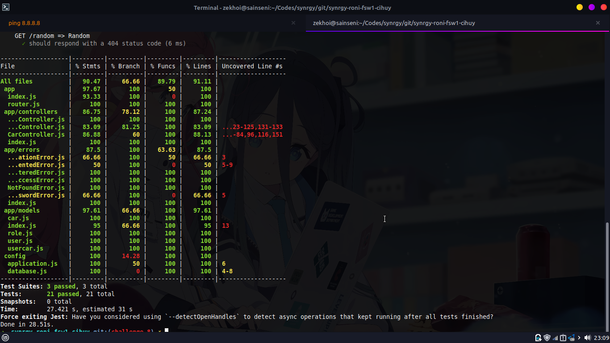

# Binar Challenge Chapter 8

Khoironi Kurnia Syah - Fullstack Web Development 1 (A) - Chapter 8

Deployed via Railway.app CLI

- Preview [Open](https://binarc8.zekhoi.dev)

## Documentation

- [Swagger](https://binarc8.zekhoi.dev/documentation)

## How to run

1. Setup database in `.env` file
2. Run `npm install` to install dependencies
3. Run `npm run db:create`, `npm run db:migrate`, `npm run db:seed` to create database, migrate table, and seed data
4. Run `npm run test` to run test

## Result

- Test result

- Test coverage

