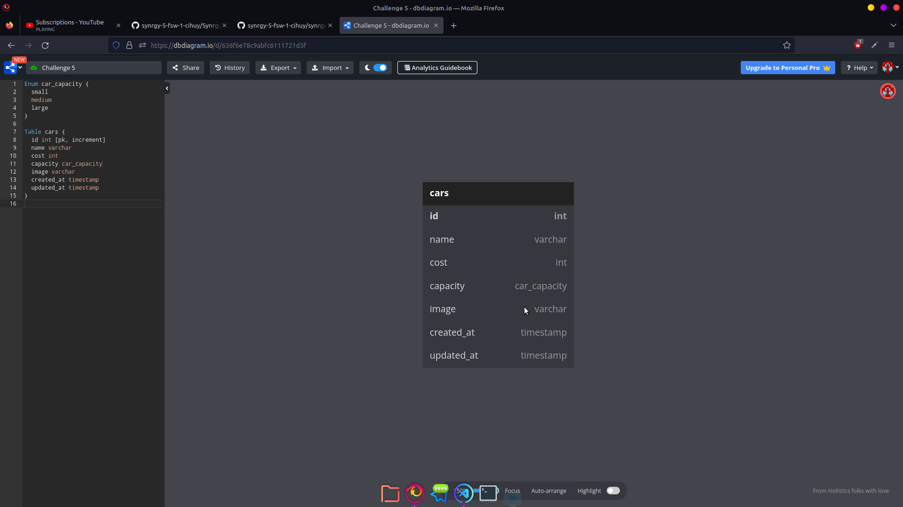

# Binar Challenge Chapter 6

Khoironi Kurnia Syah - Fullstack Web Development 1 (A) - Chapter 6

- Preview : [Open](https://binarc5.zekhoi.dev/api/cars/)
- Postman : [Open](https://www.postman.com/zekhoi/workspace/binar-synrgy/collection/14844670-019b04c1-0227-4c16-a459-0e8089f9ce58?action=share&creator=14844670)

### Diagram



## GET /api/cars/

Response

```json
{
  "message": "OK",
  "data": [
    {
      "id": 10,
      "name": "bmw",
      "cost": 3000,
      "capacity": "small",
      "image": "https://binarc4.zekhoi.dev/assets/img/cars/car01.min.jpg",
      "createdAt": "2022-11-12T11:13:31.984Z",
      "updatedAt": "2022-11-12T11:13:31.984Z"
    }
  ]
}
```

## GET /api/cars/:id => 10

Response

```json
{
  "message": "OK",
  "data": {
    "id": 10,
    "name": "bmw",
    "cost": 3000,
    "capacity": "small",
    "image": "https://binarc4.zekhoi.dev/assets/img/cars/car01.min.jpg",
    "createdAt": "2022-11-12T11:13:31.984Z",
    "updatedAt": "2022-11-12T11:13:31.984Z"
  }
}
```

## POST /api/cars/

Request

```json
{
  "name": "bmw",
  "cost": 3000,
  "capacity": "small",
  "image": "ini dalam form gatau nulis di sininya"
}
```

Response

```json
{
  "message": "Created",
  "data": {
    "id": 18,
    "name": "bmw",
    "cost": 3000,
    "capacity": "small",
    "image": "https://binarc4.zekhoi.dev/assets/img/cars/car01.min.jpg",
    "updatedAt": "2022-11-12T11:26:11.794Z",
    "createdAt": "2022-11-12T11:26:11.794Z"
  }
}
```

## PUT /api/cars/:id => 11

Request

```json
{
  "name": "lambo",
  "cost": 800000
}
```

Response

```json
{
  "message": "Car with id: 11 has been updated."
}
```

## DELETE /api/cars/:id => 11

Response

```json
{
  "message": "Car with id: 11 has been deleted"
}
```
